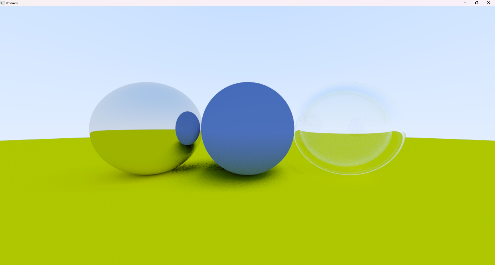

# RayTracer
A ray tracer written in c++ and opengl (im following the ray tracing in one weekend series)

Currently I can only render spheres.
As for materials, I have diffuse, metallic and dielectric.
It also makes use of BVH (bounding volume hierarchy) but right now, it is way slower than the brute force method. Maybe my traversal algorithm is unclever - this is my next goal I suppose.

Iteration one-

